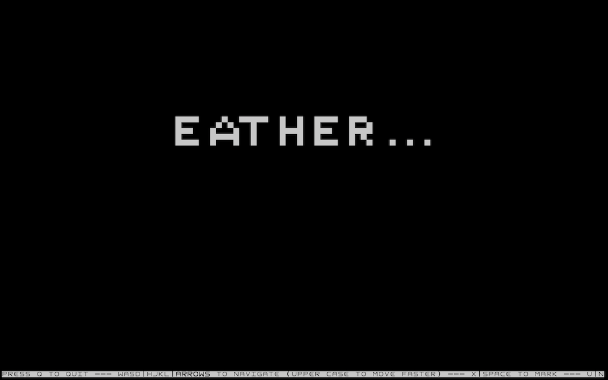

# LifeTerm
Game of life editor right on your terminal because who is web browser or app these days? 🤷

This is completely work in progress there are tons of thing to improve.

# How to 
### RUN
> The grid is based on the screen of your terminal, so make sure you larger your screen before run
`./lifeterm`

### Keymap
| Key      | Description               |
|----------|---------------------------|
| w, a, s, d  | Game style: move one step |
| W, A, S, D  | Game style: move 10 steps |
| h, j, k, l  | Vim style: move on step   |
| H, J, K, L  | Vim style: move on step   |
| Arrows   | Move on step              |
| x, space | Spawn/Kill a cell         |
| u, n     | Next generation           |
| r, R     | Refresh           |
| q        | Quit                      |

### Font
For the best experience, Use the font [square](/assets/square.ttf) on your terminal, It has square cells. 

It's the current limitation of this program since it's a text editor base.

# Todo
- [ ] Square grid cell
- [ ] Add load/save game
- [ ] Infinite grid / Dynamic size grid
