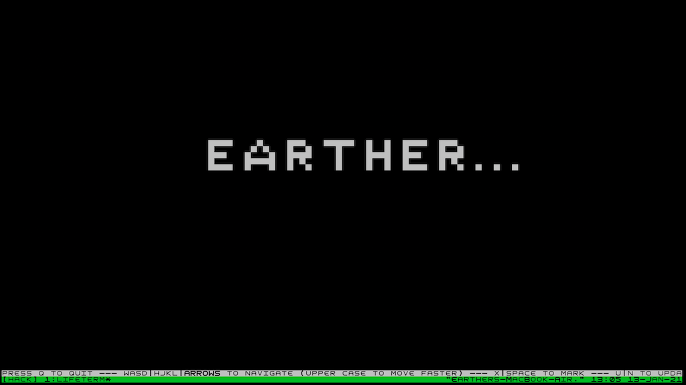

# LifeTerm
Game of life editor right on your terminal because why not? 🤷

I use the [hashlife](https://en.wikipedia.org/wiki/Hashlife) algorithm to represent the universe and update cells.

# How to 
### RUN
> The grid is based on the screen size of your terminal, so make sure you larger your screen before run

### Build
`make lifeterm`
### Run
Init an empty world

`./lifeterm.o`

Lifeterm is currently support to load pattern in Macrocell(.mc) format. Just type:

`./lifeterm.o {path}`

### Keymap
| Key      | Description               |
|----------|---------------------------|
| w, a, s, d  | Game style: move one step |
| W, A, S, D  | Game style: move 10 steps |
| h, j, k, l  | Vim style: move one step   |
| H, J, K, L  | Vim style: move one step   |
| Arrows   | Move one step              |
| x, space | Spawn/Kill a cell         |
| u, n     | Next generation           |
| r, R     | Refresh           |
| q        | Quit                      |
| i/I      | Increase/Decrease Step size by factor of 2|

### Font
For the best experience, Use the font [square](/assets/square.ttf) on your terminal, It has square cells. 

# Todo
- [x] Infinite grid / Dynamic size grid
- [ ] Square grid cell without font
- [ ] Add load/save game

